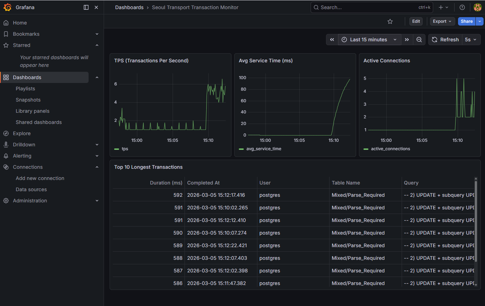

# Dashboard of transactions for PostgreSQL

PostgreSQL 에서 실행한 모든 transaction의 TPS, service time 그리고 active한 연결 수는 시간별로 표시. 부가적으로 가장 오래 실행한 query도 표로 나옴. 



## 1. 시스템 업데이트 및 필수 패키지 설치
```
sudo apt update && sudo apt upgrade -y
sudo apt install -y wget curl gnupg2 software-properties-common apt-transport-https python3-pip python3-venv python3-dev libpq-dev
```

## 2. PostgreSQL 17 구성 변경
```
# 통계 수집 활성화
sudo nano /etc/postgresql/16/main/postgresql.conf

track_activities = on
track_counts = on
track_io_timing = on
track_functions = all
track_activity_query_size = 4096

shared_preload_libraries = 'pg_stat_statements'
pg_stat_statements.track = all
pg_stat_statements.max = 30000
pg_stat_statements.track_utility = on
pg_stat_statements.save = on

log_connections = on
log_disconnections = on
log_min_duration_statement = 1000 # 1초 이상 걸리는 쿼리 로깅
```

## 3. Grafana OSS 저장소 추가 및 설치
```
wget -q -O - https://apt.grafana.com/gpg.key | gpg --dearmor | sudo tee /etc/apt/keyrings/grafana.gpg > /dev/null
echo "deb [signed-by=/etc/apt/keyrings/grafana.gpg] https://apt.grafana.com stable main" | sudo tee /etc/apt/sources.list.d/grafana.list
sudo apt update
sudo apt install -y grafana
```

## 4. 서비스 시작 및 자동 실행 설정
```
sudo systemctl enable --now postgresql
sudo systemctl enable --now grafana-server
```

## 5. Python 가상환경 생성 및 라이브러리 설치 (psycopg2, requests)
```
python3 -m venv ~/monitor_env
source ~/monitor_env/bin/activate
pip install psycopg2-binary requests python-dotenv
```

## 6. 실행 방법
```
python3 dashboard.py
# 실행하는 동안 정보를 취합해서 DB에 올림. 
```

## 7. 확인 
```
http://<IP>:3000  
# grafana로 접속
```
